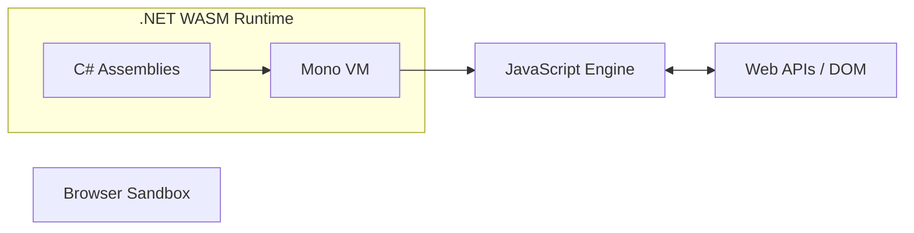

# What is WebAssembly (WASM)?

WebAssembly (WASM) is a binary instruction format for a stack-based virtual machine. It is designed as a portable compilation target for programming languages, enabling deployment on the web for client and server applications.

## Key Concepts

* **Near-Native Speed:** WASM runs at near-native speed by taking advantage of common hardware capabilities.
* **Security:** It runs in a memory-safe, sandboxed execution environment (the browser's JS engine).
* **Language Agnostic:** You can compile C++, Rust, C#, Go, and many other languages to WASM.

## How .NET runs in WASM

When you build a Blazor WebAssembly app:
1. Your C# code is compiled into standard .NET intermediate language (IL) assemblies (`.dll` files).
2. The .NET runtime itself (specifically a version of Mono) is compiled to WASM.
3. The browser downloads `dotnet.native.wasm` (the runtime) and your `.dll` assemblies.
4. The WASM runtime executes your C# IL code inside the browser.

## WASM vs. ASP.NET

| Feature | ASP.NET (Server-Side) | Blazor WebAssembly |
|---------|----------------------|--------------------|
| Execution | On the Server | In the Browser |
| Hosting | Requires .NET Server | Static File Hosting |
| Scalability | Server CPU/RAM limited | Uses Client Resources |
| Offline | No | Yes (PWA) |

## Browser Sandbox Model

WASM operates within the same security sandbox as JavaScript. It cannot:
* Access the local file system directly.
* Make arbitrary network connections (must use browser APIs like `fetch`).
* Access hardware directly (must use browser APIs like WebGPU).

