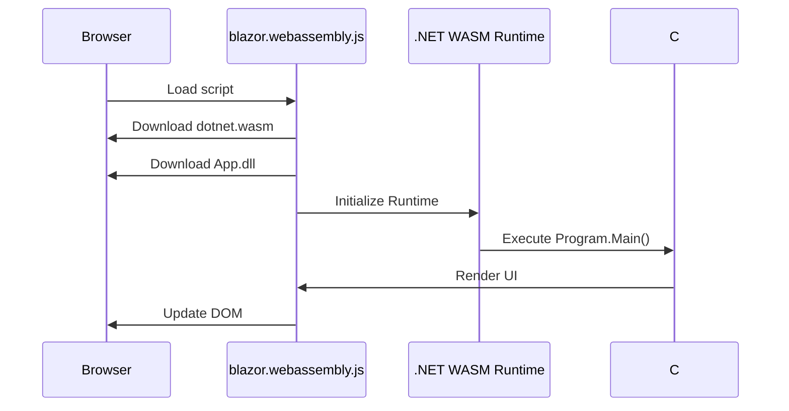

# How Blazor WebAssembly Works

Blazor WebAssembly is a single-page app (SPA) framework for building interactive client-side web apps with .NET.

## Startup Flow

1. **index.html:** The browser loads the entry HTML file.
2. **blazor.webassembly.js:** This script is the bootstrapper. It handles the WASM download and initialization.
3. **WASM Runtime:** The .NET runtime (`dotnet.native.wasm`) is loaded.
4. **Assemblies:** Your application DLLs and dependencies are downloaded.
5. **Program.Main:** The entry point of your C# application is executed.
6. **Root Component:** The `App.razor` component is rendered into the DOM.

## Component Lifecycle

Blazor components follow a specific lifecycle:
1. `OnInitializedAsync`: Setup data.
2. `OnParametersSetAsync`: Update based on parent inputs.
3. `OnAfterRenderAsync`: Interaction with the DOM (Canvas, JS Interop).

