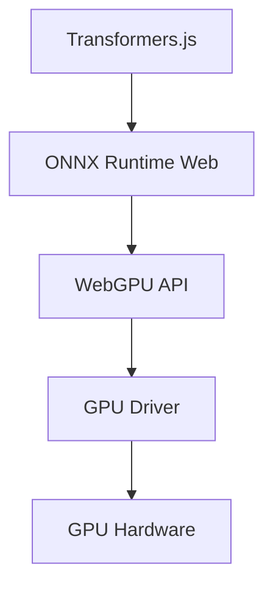

# WebGPU Explained

WebGPU is the successor to WebGL, providing a modern API for accelerated graphics and compute.

## GPU vs. CPU

* **CPU (Central Processing Unit):** Designed for general-purpose tasks and complex logic. It has a few powerful cores.
* **GPU (Graphics Processing Unit):** Designed for massive parallelism. It has thousands of smaller cores, ideal for matrix math (used in Graphics and AI).

## WebGPU Architecture

WebGPU allows the browser to talk directly to modern native APIs like **Vulkan**, **Metal**, or **Direct3D 12**.

## Why Transformers.js uses WebGPU

AI Inference (running a model) is essentially a series of huge matrix multiplications.
* On the **CPU**, these take a long time because the cores must process them sequentially or in small batches.
* On the **GPU** (via WebGPU), these multiplications can be done simultaneously, leading to 10x-100x speed increases.

