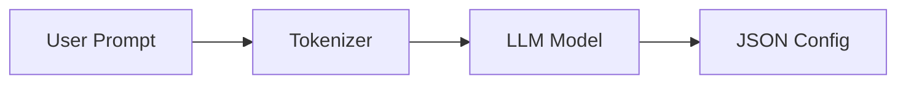

# Transformers.js Explained

Transformers.js is a library that allows you to run state-of-the-art Machine Learning models directly in your browser.

## The Pipeline API

Transformers.js uses a "Pipeline" abstraction that simplifies the process:
1. **Model Loading:** Downloads the model weights (usually in ONNX format).
2. **Tokenization:** Converts text into numbers (tokens) the model understands.
3. **Inference:** The model processes the tokens.
4. **Post-processing:** Converts the model's numerical output back into text or data.

## Local Inference Benefits

* **Privacy:** Data never leaves the user's browser.
* **Cost:** No expensive GPU server costs for the developer.
* **Latency:** No network round-trips to an API like OpenAI.

