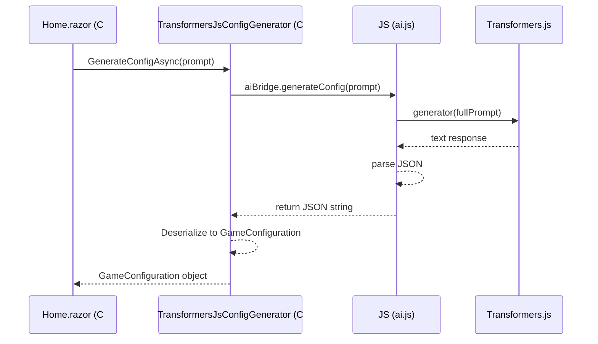

# JavaScript Interop Deep Dive

In Blazor WebAssembly, C# and JavaScript live in the same browser tab but in different worlds. JS Interop is the bridge between them.

## Blazor to JavaScript

Use `IJSRuntime.InvokeAsync<T>` or `InvokeVoidAsync`.

**Example:**
`await JSRuntime.InvokeVoidAsync("console.log", "Hello from C#!");`

## JavaScript to Blazor

Use `[JSInvokable]` attribute on a C# method.

## Sequence in AI Snake Studio

We use Dependency Injection to manage the AI connection. The UI depends on the `IGameConfigurationGenerator` interface, which is implemented by the `TransformersJsConfigGenerator`.

