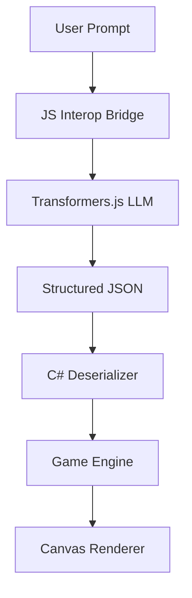

# AI Theme Generation Flow

This document describes how a user's natural language prompt becomes a playable game theme.

## Step-by-Step Flow

1. **User Input:** User types "Neon Cyberpunk" in the UI.
2. **C# Trigger:** The `GenerateAIConfig` method is called in `Home.razor`.
3. **JS Bridge:** C# calls `aiBridge.generateConfig` via JS Interop.
4. **LLM Inference:** `Transformers.js` uses `SmolLM2` to generate a structured JSON string.
5. **JSON Return:** The string is returned to C#.
6. **Deserialization:** C# converts the JSON into `Theme` and `GameRules` objects.
7. **State Update:** `GameState` and `ThemeManager` are updated.
8. **Render:** The `ThemeRenderer` uses the new colors for the next frame.

