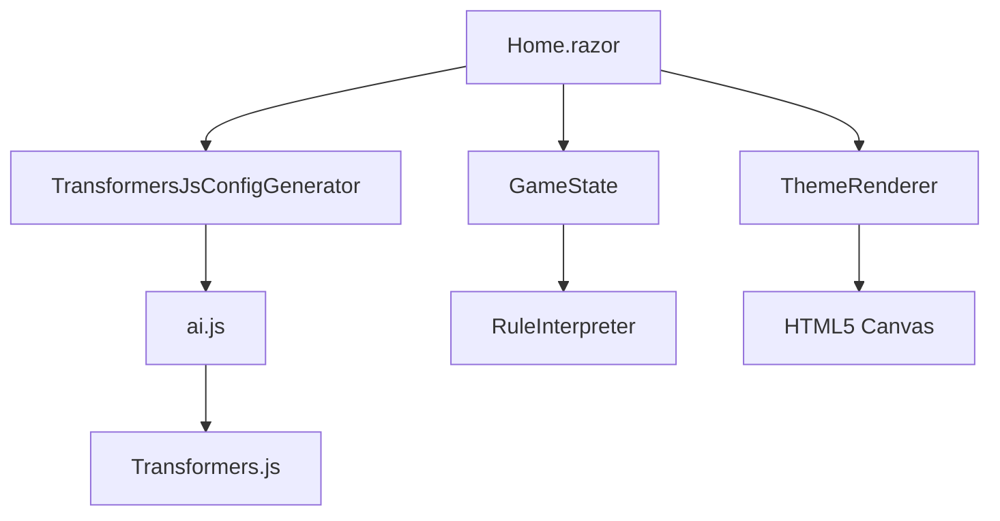
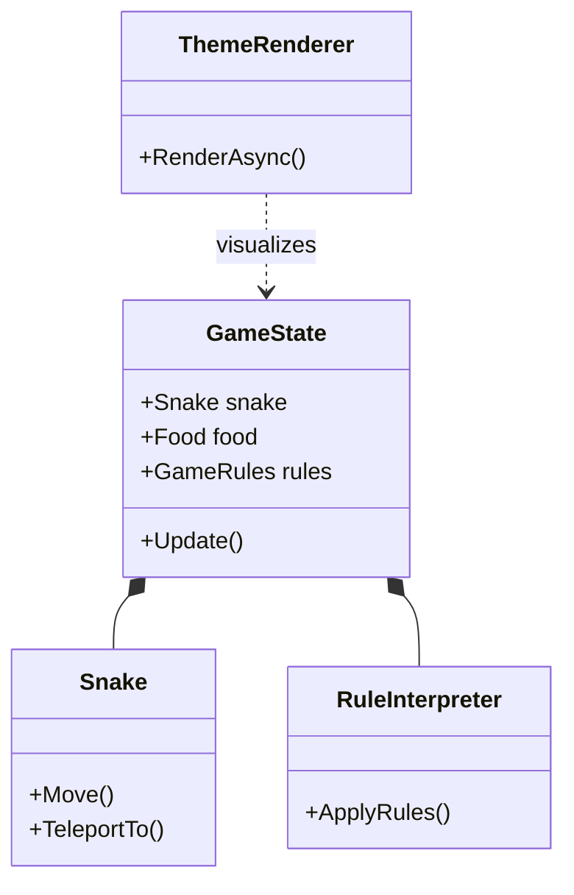

# Project Architecture

AI Snake Studio is built with a clean separation of concerns, following the Open/Closed Principle and Data-Driven Design.

## Component Responsibilities

* **GameEngine:** Core logic (Snake, Food, Board, Rules). Completely decoupled from UI.
* **Renderer:** Interprets `GameState` and draws it to the Canvas.
* **ThemeManager:** Handles visual styles.
* **RuleInterpreter:** Applies high-level rules to engine behavior.
* **TransformersJsConfigGenerator:** Orchestrates AI inference.
* **ai.js:** The JavaScript host for Transformers.js.

## Folder Structure

* `GameEngine/`: The "Heart" of the application (C# logic).
* `Pages/`: Blazor components (UI).
* `wwwroot/js/`: JavaScript logic (Renderer, AI).
* `docs/`: Educational reference material.
* `tests/`: xUnit tests for engine logic.

## Execution Flow

## Dependency Graph

