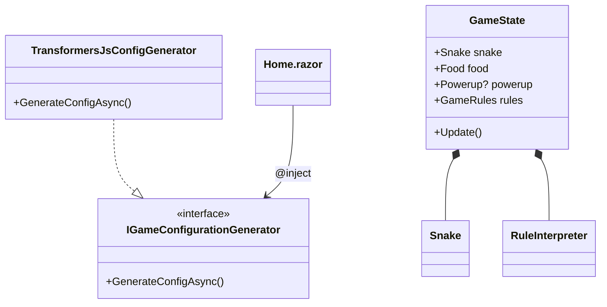

# Project Architecture

AI Snake Studio is built with a clean separation of concerns, following the Open/Closed Principle and Data-Driven Design.

## Component Responsibilities

* **GameEngine:** Core logic (Snake, Food, Board, Rules, Powerups). Completely decoupled from UI.
* **Renderer:** Interprets `GameState` and draws it to the Canvas.
* **ThemeManager:** Handles visual styles.
* **RuleInterpreter:** Applies high-level rules and powerup effects to engine behavior.
* **IGameConfigurationGenerator:** Interface for AI inference services.
* **TransformersJsConfigGenerator:** Orchestrates AI inference using Transformers.js.
* **ai.js:** The JavaScript host for Transformers.js.

## Dependency Graph

