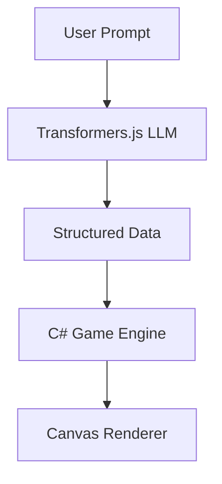

# Read This First

Welcome to **AI Snake Studio**!

This project is not just a game; it is a **reference implementation** designed to teach you how to build modern, AI-powered applications that run entirely in the browser using .NET and Blazor WebAssembly.

## Learning Objectives

By exploring this codebase, you will learn:
1. **Blazor WASM:** How to run C# in the browser.
2. **WebGPU:** How to leverage the GPU for high-performance compute and AI.
3. **Transformers.js:** How to run Large Language Models (LLMs) locally.
4. **JS Interop:** How to bridge the gap between .NET and JavaScript.
5. **Clean Architecture:** How to separate game logic, rendering, and AI.

## How to use this project

1. **Play the game:** Try the AI prompt. Watch how it changes not just the colors (Theme) but also the physics (Rules).
2. **Read the Docs:** Start with `docs/reference-walkthrough.md`.
3. **Inspect the Code:** Every file starts with a "READ THIS FIRST" section.
4. **Debug:** Use the `docs/learning-path/02-how-to-debug.md` guide to see what's happening under the hood.

## The Architecture at a Glance

