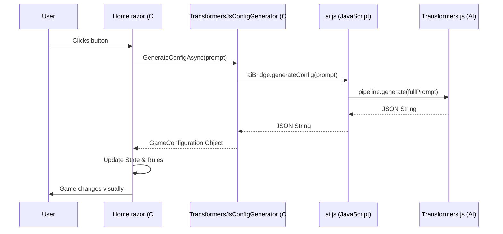

# Follow the Request

This document traces exactly what happens when you click **"Apply AI Vision"**.

## The Flow of a Single AI Request

1. **User Action:** You type "Matrix theme with no walls" and click the button.
2. **Blazor Event:** `GenerateAIConfig` in `Home.razor` is triggered.
3. **C# to JS Bridge:**
   - `TransformersJsConfigGenerator` calls `IJSRuntime.InvokeAsync("aiBridge.generateConfig")`.
   - The .NET runtime pauses execution (await) and passes the prompt string to the JavaScript engine.
4. **JavaScript Processing:**
   - `aiBridge.generateConfig` (in `ai.js`) receives the string.
   - If not already loaded, it initializes the `transformers` pipeline.
   - It constructs a "System Prompt" that instructs the LLM to output ONLY JSON.
5. **AI Inference:**
   - `Transformers.js` passes the prompt to the **SmolLM2** model.
   - The model runs on your **GPU** (via WebGPU) or **CPU** (via WASM).
   - Tokens are generated one by one until the JSON object is complete.
6. **JSON Contract:**
   - The model produces: `{"theme": {"name": "Matrix", ...}, "rules": {"walls": false, ...}}`.
   - `ai.js` cleans up any accidental text and returns the string to Blazor.
7. **C# Integration:**
   - Blazor resumes execution.
   - `JsonSerializer` parses the string into a `GameConfiguration` C# object.
   - `_themeManager.AddTheme()` registers the new look.
   - `_gameState.Rules` is updated with the new physics.
8. **Reactivity:**
   - `StateHasChanged()` is called (implicitly via `InvokeAsync` or explicitly).
   - The `ThemeRenderer` starts using the new colors in the very next frame of the game loop.

