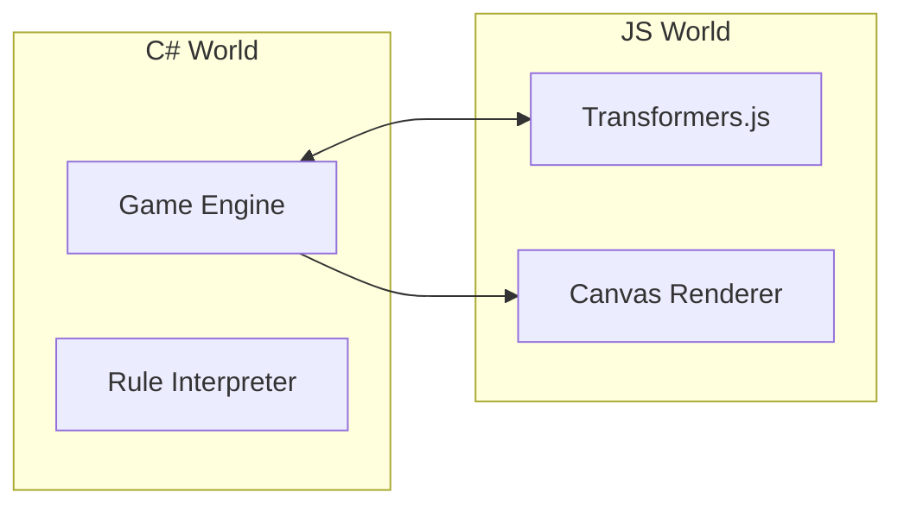

# Build It Yourself: Step-by-Step

This guide will help you rebuild AI Snake Studio from scratch, focusing on the C# architecture and the AI integration.

## Step 1: Initialize the Project
Create a new Blazor WebAssembly standalone project.
```bash
dotnet new blazorwasm -o AISnakeGame
```

## Step 2: The Core Game Engine (C#)
Don't start with the UI. Start with the logic. Create a `GameEngine/` folder.
1. **Point.cs:** Create a record for coordinates.
2. **Snake.cs:** Handle the list of points and movement logic. **Pro Tip:** Keep movement logic independent of frame rate.
3. **GameState.cs:** This is your "Orchestrator". It should hold the `Snake`, `Food`, and `Board`.

## Step 3: The Canvas Renderer (JS Interop)
Blazor is great for UI, but for games, you want the **HTML5 Canvas**.
1. Create `wwwroot/js/gameRenderer.js`.
2. Write a JS function that takes a JSON representation of the game state and draws it using `ctx.fillRect`.
3. In C#, create a `Renderer.cs` that uses `IJSRuntime` to call that JS function.

## Step 4: The Theme System (Open/Closed Principle)
Instead of hardcoding colors, create a `Theme.cs` class.
- Update your `gameRenderer.js` to accept a `theme` object.
- Now, you can change the game's look just by passing a different C# object!

## Step 5: Integrating Transformers.js
This is where the magic happens.
1. **ai.js:** Import Transformers.js from a CDN.
2. **JS Bridge:** Create an object on `window` (e.g., `window.aiBridge`) with a function to run inference.
3. **C# Service:** Create `TransformersJsConfigGenerator.cs`. This is a C# service that acts as a proxy for the JS AI logic.

## Step 6: Data-Driven Rules
Create `GameRules.cs`. These should control things like:
- `SpeedMultiplier`
- `Teleport` (wrapping around the screen)
- `Walls` (dying when hitting edges)

Create a `RuleInterpreter.cs`. Its job is to look at the `GameRules` and the `Snake` position to decide what happens next.

## Step 7: The Prompt Engineering
In `ai.js`, your "System Prompt" is critical. You must tell the AI:
1. "You are a game designer."
2. "Output ONLY valid JSON."
3. "Follow this specific schema."

## Why this Architecture?
By keeping the AI logic in JS, the Game Engine in C#, and the Rendering in a separate JS module, you have a **clean separation of concerns**. You can swap the AI model (SmolLM for Phi) or the Renderer (Canvas for WebGL) without breaking the game!


